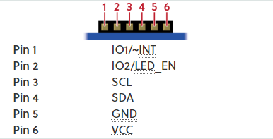
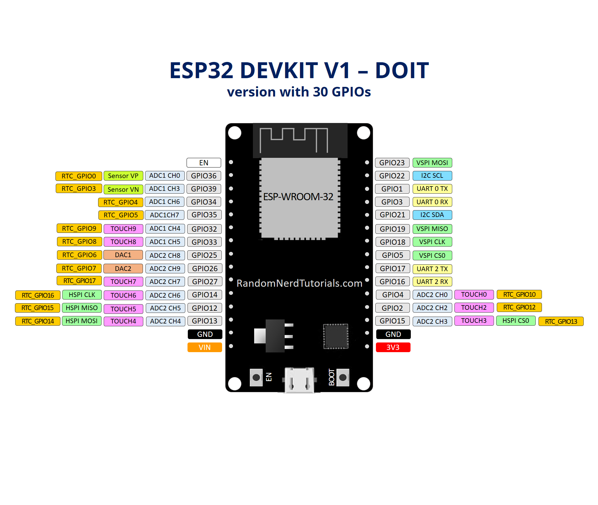

# esp32_web_server_pmod_color

This is a project for an embedded web server on the ESP-WROOM-32 ESP32 ESP-32S Development Board wired to a <a href="https://digilent.com/reference/pmod/pmodcolor/start">Pmod COLOR<a> that sends data of the color it is looking at on a local network to an internet browser plus with the ability to switch an LED on the ESP-WROOM-32 ESP32 ESP-32S Development Board from your internet browser.

To use project copy the code to Arduino IDE (I used version 2.0.4) and edit the code on top were you see '#define LOCAL_SSID "your_home_ssid"' and '#define LOCAL_PASS "your_home_password"' with your own network SSID and PASSWORD and setup the environment for the ESP-WROOM-32 ESP32 ESP-32S Development Board on the Arduino IDE. Next with your <a href="https://digilent.com/reference/pmod/pmodcolor/start">Pmod COLOR<a> connect pin 6 and 2 on your <a href="https://digilent.com/reference/pmod/pmodcolor/start">Pmod COLOR<a> to 3.3 V on your ESP-WROOM-32 ESP32 ESP-32S Development Board or external device (Don't forget to connect all devices grounds to each other) and pin 5 on the <a href="https://digilent.com/reference/pmod/pmodcolor/start">Pmod COLOR<a> to ground. Afterwards, connect pin 3 on the <a href="https://digilent.com/reference/pmod/pmodcolor/start">Pmod COLOR<a> to GPIO22 on your ESP-WROOM-32 ESP32 ESP-32S Development Board and connect pin 4 on your <a href="https://digilent.com/reference/pmod/pmodcolor/start">Pmod COLOR<a> to GPIO21 on your ESP-WROOM-32 ESP32 ESP-32S Development Board. Lastly, upload the code to your ESP-WROOM-32 ESP32 ESP-32S Development Board then put the local IP address of it connected to your local router in a internet browser, you can find this address in the Serial Monitor of your Arduino IDE with baud rate of 115200 or by logging in your local router. I also have included pictures of the pinouts.

Pmod COLOR Pinout

ESP-WROOM-32 ESP32 ESP-32S Development Board Pinout

